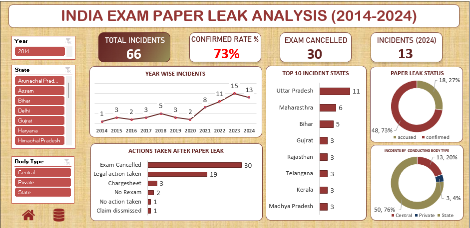

# India Exam Paper Leak Analysis (2014–2024)

> ### 📷 Dashboard Preview

  

---

## 📌 Project Overview

This project presents an interactive Microsoft Excel dashboard analyzing paper leak incidents in India from 2014 to 2024. The dashboard provides insights into incident trends, affected states, conducting body types, confirmation status, and actions taken by authorities. It enables users to explore the data interactively through KPIs, Pivot Charts, and Slicers.

---

## 🎯 Business Requirements

- Analyze paper leak incidents across India.
- Identify year-wise trends.
- Determine the most affected states.
- Compare incidents by conducting body type.
- Analyze confirmation status and actions taken.

---

## 📊 KPI Metrics

- Total Incidents
- Confirmed Rate (%)
- Exams Cancelled
- Incidents (2024)

---

## 📈 Dashboard Visuals

- Year-wise Paper Leak Incidents
- Top 10 States by Paper Leak Incidents
- Paper Leak Status
- Actions Taken After Paper Leak
- Incidents by Conducting Body Type

---

## 🧹 Data Cleaning (Pandas)

The raw dataset was cleaned and standardized using **Python (Pandas)** before being analyzed in Microsoft Excel.

### Cleaning Steps

- Removed duplicate records (where applicable).
- Standardized state names and categorical values.
- Standardized **Leak Confirmation Status** and **Action Taken** values.
- Extracted **Year**, **Month**, and **Quarter** from the incident date.
- Handled missing and inconsistent records.
- Prepared the final dataset for Pivot Tables and dashboard analysis.

> **Notebook:** `notebooks/paperleaks.ipynb`

---

## 📂 Data Source

The dataset was compiled from **publicly available news reports, government announcements, and media sources** covering paper leak incidents in India between **2014 and 2024**.

---

## 💡 Key Insights

- Analyzed **66** paper leak incidents reported across India between **2014–2024**.
- **73%** of reported incidents were officially confirmed.
- **2023** recorded the highest number of reported paper leak incidents.
- **Uttar Pradesh** was the most affected state in the dataset.
- State-level conducting bodies accounted for the majority of reported incidents.
- Exam cancellation was the most common administrative action taken after a paper leak.

---

## 📌 Conclusion

The analysis highlights the growing concern of paper leak incidents in India over the past decade. Most reported cases were officially confirmed, with state-level examinations experiencing the highest number of incidents. Strengthening examination security, improving monitoring mechanisms, and adopting proactive preventive measures can help reduce future paper leak incidents and improve examination integrity.

---

## 🛠️ Tools & Technologies Used

### Tools

- Microsoft Excel
- Python
- Pandas

### Excel Features

- Pivot Tables
- Pivot Charts
- KPI Cards
- Slicers
- GETPIVOTDATA
- Conditional Formatting
- Interactive Dashboard Design
